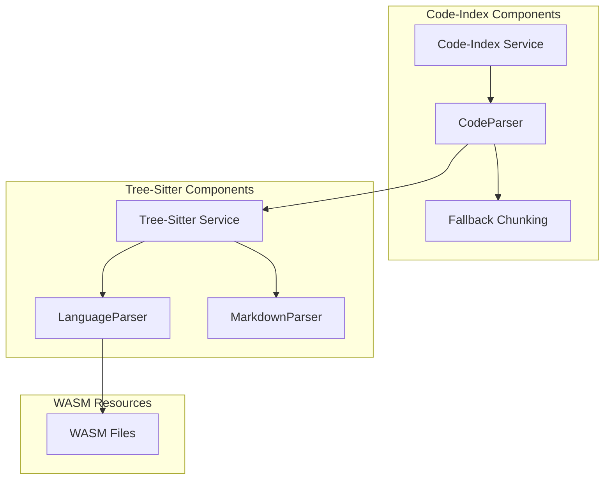
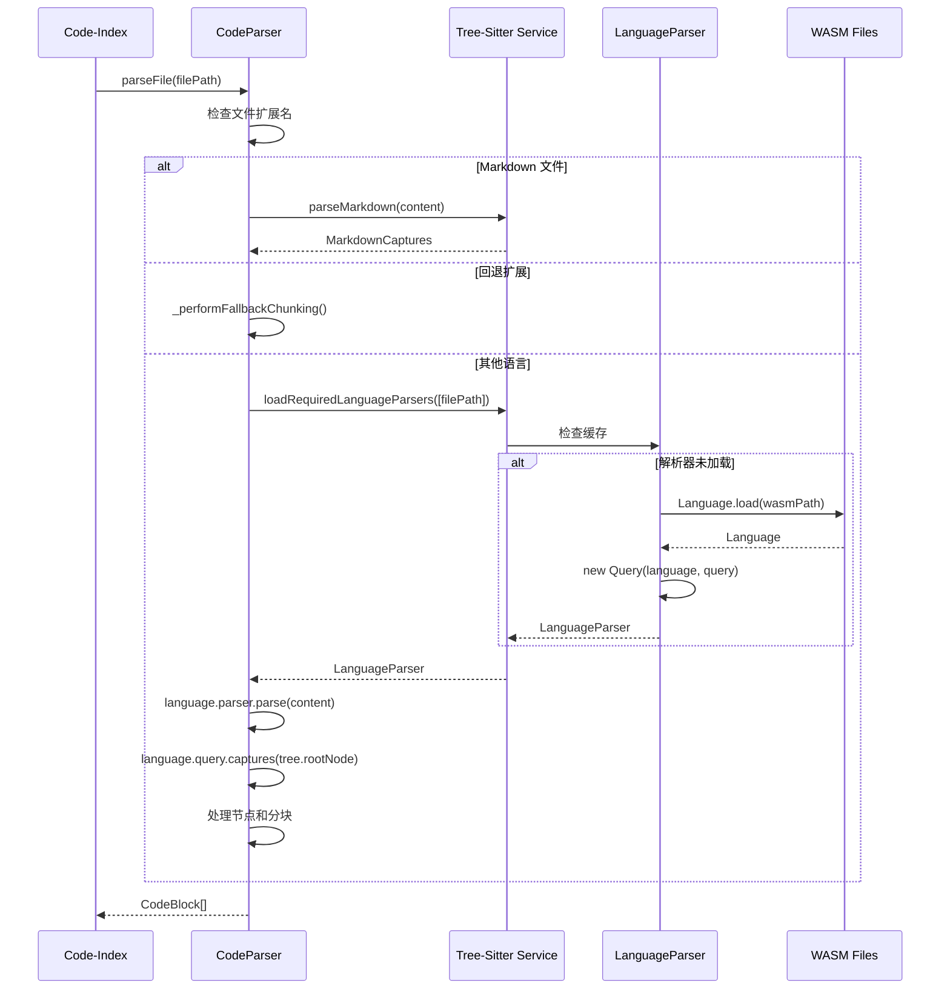

# Code-Index 与 Tree-Sitter 集成分析

## 概述

`src/services/code-index` 目录通过 `src/services/tree-sitter` 服务实现了与 tree-sitter 的深度集成，用于代码索引和语义分析。本文档详细分析了这种集成架构和工作流程。

## 架构概览



## 核心集成点

### 1. 解析器集成 (parser.ts)

**文件位置**: [`src/services/code-index/processors/parser.ts`](src/services/code-index/processors/parser.ts)

**关键导入**:
```typescript
import { Node } from "web-tree-sitter"
import { LanguageParser, loadRequiredLanguageParsers } from "../../tree-sitter/languageParser"
import { parseMarkdown } from "../../tree-sitter/markdownParser"
```

**集成方式**:

#### 1.1 语言解析器加载

[`CodeParser`](src/services/code-index/processors/parser.ts:15) 类通过 [`loadRequiredLanguageParsers`](src/services/tree-sitter/languageParser.ts:78) 函数动态加载 tree-sitter 语言解析器：

```typescript
// 第 103-127 行
if (!this.loadedParsers[ext]) {
    const pendingLoad = this.pendingLoads.get(ext)
    if (pendingLoad) {
        try {
            await pendingLoad
        } catch (error) {
            console.error(`Error in pending parser load for ${filePath}:`, error)
            return []
        }
    } else {
        const loadPromise = loadRequiredLanguageParsers([filePath])
        this.pendingLoads.set(ext, loadPromise)
        try {
            const newParsers = await loadPromise
            if (newParsers) {
                this.loadedParsers = { ...this.loadedParsers, ...newParsers }
            }
        } catch (error) {
            console.error(`Error loading language parser for ${filePath}:`, error)
            return []
        } finally {
            this.pendingLoads.delete(ext)
        }
    }
}
```

**特点**:
- **懒加载**: 只在需要时加载对应语言的解析器
- **缓存机制**: 使用 `loadedParsers` 缓存已加载的解析器
- **并发控制**: 使用 `pendingLoads` 防止重复加载同一语言

#### 1.2 语法树解析

加载解析器后，使用 tree-sitter 解析代码并提取语义节点：

```typescript
// 第 135-139 行
const tree = language.parser.parse(content)
const captures = tree ? language.query.captures(tree.rootNode) : []
```

**工作流程**:
1. 使用语言解析器解析源代码生成语法树
2. 使用预定义的查询（Query）从语法树中捕获感兴趣的节点
3. 返回捕获的节点列表用于后续处理

#### 1.3 节点处理和分块

对捕获的节点进行处理，根据大小决定是否需要进一步分块：

```typescript
// 第 156-210 行
const queue: Node[] = Array.from(captures).map((capture) => capture.node)

while (queue.length > 0) {
    const currentNode = queue.shift()!
    
    // 检查节点是否满足最小字符要求
    if (currentNode.text.length >= MIN_BLOCK_CHARS) {
        // 如果超过最大字符限制，尝试分解
        if (currentNode.text.length > MAX_BLOCK_CHARS * MAX_CHARS_TOLERANCE_FACTOR) {
            if (currentNode.children.filter((child) => child !== null).length > 0) {
                // 如果有子节点，处理子节点
                queue.push(...currentNode.children.filter((child) => child !== null))
            } else {
                // 如果是叶子节点，按行分块
                const chunkedBlocks = this._chunkLeafNodeByLines(
                    currentNode,
                    filePath,
                    fileHash,
                    seenSegmentHashes,
                )
                results.push(...chunkedBlocks)
            }
        } else {
            // 节点满足要求，创建代码块
            const identifier =
                currentNode.childForFieldName("name")?.text ||
                currentNode.children.find((c) => c?.type === "identifier")?.text ||
                null
            const type = currentNode.type
            // ... 创建 CodeBlock
        }
    }
}
```

### 2. 语言解析器服务 (languageParser.ts)

**文件位置**: [`src/services/tree-sitter/languageParser.ts`](src/services/tree-sitter/languageParser.ts)

**核心功能**:

#### 2.1 WASM 语言加载

```typescript
// 第 40-51 行
async function loadLanguage(langName: string, sourceDirectory?: string) {
    const baseDir = sourceDirectory || __dirname
    const wasmPath = path.join(baseDir, `tree-sitter-${langName}.wasm`)
    
    try {
        const { Language } = require("web-tree-sitter")
        return await Language.load(wasmPath)
    } catch (error) {
        console.error(`Error loading language: ${wasmPath}: ${error instanceof Error ? error.message : error}`)
        throw error
    }
}
```

**技术选型说明**:
- 使用 **WASM** 而非原生绑定，避免与 Electron 的兼容性问题
- 使用 `web-tree-sitter` 和 `tree-sitter-wasms` 提供预构建的 WASM 二进制文件
- 无需为不同架构构建，提高跨平台兼容性

#### 2.2 支持的语言映射

```typescript
// 第 94-210 行
switch (ext) {
    case "js":
    case "jsx":
    case "json":
        language = await loadLanguage("javascript", sourceDirectory)
        query = new Query(language, javascriptQuery)
        break
    case "ts":
        language = await loadLanguage("typescript", sourceDirectory)
        query = new Query(language, typescriptQuery)
        break
    // ... 更多语言
}
```

**支持的语言**:
- JavaScript/TypeScript/TSX
- Python
- Rust
- Go
- C/C++/C#
- Ruby
- Java
- PHP
- Swift
- Kotlin
- CSS
- HTML
- OCaml
- Solidity
- TOML
- Vue
- Lua
- SystemRDL
- TLA+
- Zig
- Elm
- Embedded Template (EJS/ERB)
- Elisp
- Elixir

### 3. Markdown 特殊处理

**文件位置**: [`src/services/tree-sitter/markdownParser.ts`](src/services/tree-sitter/markdownParser.ts)

**集成方式**:

Markdown 文件不使用 tree-sitter 解析，而是使用自定义解析器：

```typescript
// parser.ts 第 92-95 行
if (ext === "md" || ext === "markdown") {
    return this.parseMarkdownContent(filePath, content, fileHash, seenSegmentHashes)
}
```

**Markdown 解析特点**:
- 提取标题和章节
- 按标题级别分类（h1, h2, h3...）
- 保持与 tree-sitter 捕获结构兼容的接口

### 4. 回退机制 (Fallback Chunking)

**文件位置**: [`src/services/code-index/shared/supported-extensions.ts`](src/services/code-index/shared/supported-extensions.ts)

**回退扩展列表**:
```typescript
export const fallbackExtensions = [
    ".vb",      // Visual Basic .NET - 没有专用的 WASM 解析器
    ".scala",   // Scala - 使用回退分块而非 Lua 查询变通方案
    ".swift",   // Swift - 由于解析器不稳定使用回退分块
]
```

**回退触发条件**:

1. **扩展名匹配**: 文件扩展名在 `fallbackExtensions` 列表中
2. **解析失败**: tree-sitter 解析器加载失败
3. **无捕获结果**: 解析成功但没有捕获到任何节点

**回退处理**:
```typescript
// parser.ts 第 367-375 行
private _performFallbackChunking(
    filePath: string,
    content: string,
    fileHash: string,
    seenSegmentHashes: Set<string>,
): CodeBlock[] {
    const lines = content.split("\n")
    return this._chunkTextByLines(lines, filePath, fileHash, "fallback_chunk", seenSegmentHashes)
}
```

## 数据流



## 查询系统

### 查询文件位置

查询文件位于 [`src/services/tree-sitter/queries/`](src/services/tree-sitter/queries/) 目录，每个语言一个查询文件。

### 查询示例 (TypeScript)

```typescript
// queries/typescript.ts
export default `
(function_declaration
  name: (identifier) @definition.function
  body: (statement_block) @definition.function.body) @definition.function

(class_declaration
  name: (type_identifier) @definition.class
  body: (class_body) @definition.class.body) @definition.class

(interface_declaration
  name: (type_identifier) @definition.interface
  body: (interface_body) @definition.interface.body) @definition.interface

// ... 更多查询模式
`
```

### 查询作用

- **定义提取**: 识别函数、类、接口等定义
- **语义分析**: 理解代码结构
- **代码导航**: 支持代码跳转和查找引用

## 配置和常量

### 支持的扩展名

**文件位置**: [`src/services/tree-sitter/index.ts`](src/services/tree-sitter/index.ts:32)

```typescript
const extensions = [
    "tla", "js", "jsx", "ts", "vue", "tsx", "py", "rs", "go",
    "c", "h", "cpp", "hpp", "cs", "rb", "java", "php", "swift",
    "sol", "kt", "kts", "ex", "exs", "el", "html", "htm",
    "md", "markdown", "json", "css", "rdl", "ml", "mli",
    "lua", "scala", "toml", "zig", "elm", "ejs", "erb", "vb"
].map((e) => `.${e}`)
```

### 分块常量

**文件位置**: [`src/services/code-index/constants/index.ts`](src/services/code-index/constants/index.ts)

```typescript
export const MIN_BLOCK_CHARS = 50          // 最小块字符数
export const MAX_BLOCK_CHARS = 2000        // 最大块字符数
export const MIN_CHUNK_REMAINDER_CHARS = 100  // 最小剩余块字符数
export const MAX_CHARS_TOLERANCE_FACTOR = 1.5 // 最大字符容差因子
```

## 性能优化

### 1. 解析器缓存

```typescript
// parser.ts 第 16 行
private loadedParsers: LanguageParser = {}
```

- 避免重复加载同一语言的解析器
- 提高后续文件解析速度

### 2. 并发加载控制

```typescript
// parser.ts 第 17 行
private pendingLoads: Map<string, Promise<LanguageParser>> = new Map()
```

- 防止同一语言的多个文件同时触发加载
- 确保解析器只加载一次

### 3. 懒加载

- 只在需要时加载解析器
- 减少初始化时间和内存占用

### 4. 智能分块

- 根据节点大小自动决定是否分块
- 优先使用子节点而非强制分块
- 保持语义完整性

## 错误处理

### 1. 解析器加载失败

```typescript
// parser.ts 第 120-125 行
catch (error) {
    console.error(`Error loading language parser for ${filePath}:`, error)
    return []
} finally {
    this.pendingLoads.delete(ext)
}
```

### 2. 解析失败回退

```typescript
// parser.ts 第 142-150 行
if (captures.length === 0) {
    if (content.length >= MIN_BLOCK_CHARS) {
        const blocks = this._performFallbackChunking(filePath, content, fileHash, seenSegmentHashes)
        return blocks
    } else {
        return []
    }
}
```

### 3. 文件读取错误

```typescript
// parser.ts 第 50-56 行
try {
    content = await readFile(filePath, "utf8")
    fileHash = this.createFileHash(content)
} catch (error) {
    console.error(`Error reading file ${filePath}:`, error)
    return []
}
```

## 测试覆盖

### 单元测试

**文件位置**: [`src/services/code-index/processors/__tests__/parser.spec.ts`](src/services/code-index/processors/__tests__/parser.spec.ts)

**测试内容**:
- 解析器加载
- 文件解析
- 分块逻辑
- Markdown 处理
- 回退机制

### 集成测试

**文件位置**: [`src/services/tree-sitter/__tests__/`](src/services/tree-sitter/__tests__/)

**测试内容**:
- 各语言的解析测试
- 查询验证
- Markdown 集成测试

## 使用示例

### 基本使用

```typescript
import { codeParser } from "./services/code-index/processors/parser"

// 解析文件
const codeBlocks = await codeParser.parseFile("/path/to/file.ts")

// codeBlocks 包含:
// - file_path: 文件路径
// - identifier: 函数/类名
// - type: 节点类型
// - start_line: 起始行号
// - end_line: 结束行号
// - content: 代码内容
// - segmentHash: 段哈希
// - fileHash: 文件哈希
```

### 带选项的解析

```typescript
const codeBlocks = await codeParser.parseFile("/path/to/file.ts", {
    content: "直接提供的内容",
    fileHash: "预计算的哈希"
})
```

## 总结

### 集成特点

1. **模块化设计**: code-index 和 tree-sitter 服务分离，职责清晰
2. **灵活的解析策略**: 支持 tree-sitter 解析、Markdown 解析和回退分块
3. **性能优化**: 缓存、懒加载、并发控制
4. **健壮的错误处理**: 多层回退机制确保系统稳定性
5. **广泛的语言支持**: 支持 30+ 种编程语言

### 技术亮点

- **WASM 架构**: 避免原生绑定兼容性问题
- **智能分块**: 基于语义的代码分块，保持代码完整性
- **查询驱动**: 使用 tree-sitter 查询系统提取语义信息
- **可扩展性**: 易于添加新语言支持

### 应用场景

1. **代码索引**: 为代码搜索建立语义索引
2. **代码导航**: 支持函数、类的快速定位
3. **代码分析**: 理解代码结构和依赖关系
4. **智能搜索**: 基于语义的代码搜索
5. **代码折叠**: 生成代码摘要和签名

## 相关文件清单

### Code-Index 核心文件

- [`src/services/code-index/processors/parser.ts`](src/services/code-index/processors/parser.ts) - 主解析器
- [`src/services/code-index/shared/supported-extensions.ts`](src/services/code-index/shared/supported-extensions.ts) - 支持的扩展名
- [`src/services/code-index/constants/index.ts`](src/services/code-index/constants/index.ts) - 配置常量

### Tree-Sitter 核心文件

- [`src/services/tree-sitter/languageParser.ts`](src/services/tree-sitter/languageParser.ts) - 语言解析器加载
- [`src/services/tree-sitter/index.ts`](src/services/tree-sitter/index.ts) - 主入口和定义提取
- [`src/services/tree-sitter/markdownParser.ts`](src/services/tree-sitter/markdownParser.ts) - Markdown 解析器
- [`src/services/tree-sitter/queries/`](src/services/tree-sitter/queries/) - 语言查询文件

### 测试文件

- [`src/services/code-index/processors/__tests__/parser.spec.ts`](src/services/code-index/processors/__tests__/parser.spec.ts)
- [`src/services/tree-sitter/__tests__/languageParser.spec.ts`](src/services/tree-sitter/__tests__/languageParser.spec.ts)
- [`src/services/tree-sitter/__tests__/markdownIntegration.spec.ts`](src/services/tree-sitter/__tests__/markdownIntegration.spec.ts)