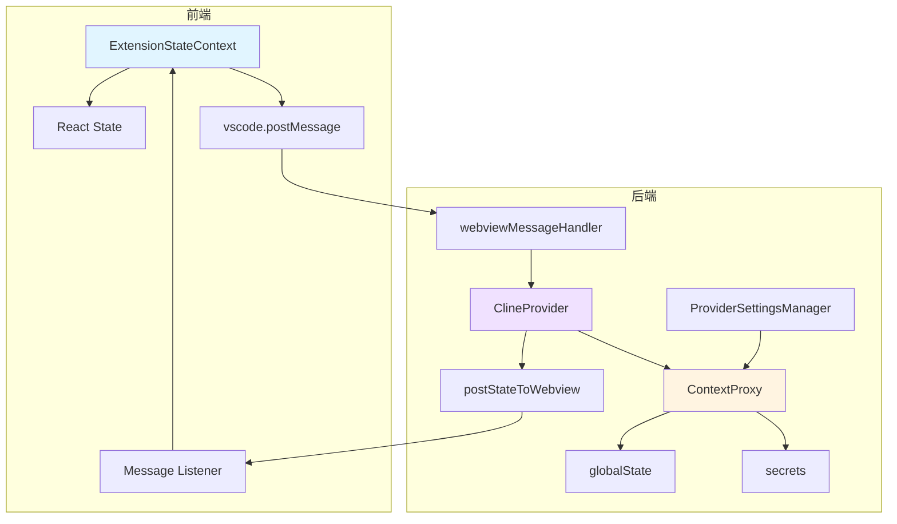

# 前后端配置传递方式分析报告

## 一、配置传递方式概览

### 1. 前端（webview-ui）配置传递方式

**主要方式：**
- **Context API + React State**：通过 [`ExtensionStateContext`](webview-ui/src/context/ExtensionStateContext.tsx:142) 管理全局状态
- **VSCode Webview API**：通过 [`vscode.postMessage()`](webview-ui/src/utils/vscode.ts:36) 发送消息到后端
- **Message Event Listener**：监听来自后端的 [`window.addEventListener("message")`](webview-ui/src/context/ExtensionStateContext.tsx:440)

**关键组件：**
- [`ExtensionStateContext`](webview-ui/src/context/ExtensionStateContext.tsx:142) - 状态管理核心
- [`mergeExtensionState()`](webview-ui/src/context/ExtensionStateContext.tsx:144) - 状态合并逻辑
- [`vscode`](webview-ui/src/utils/vscode.ts:84) - VSCode API 封装

### 2. 后端（src）配置传递方式

**主要方式：**
- **ContextProxy**：统一的配置访问层，封装 VSCode 的 globalState 和 secrets
- **postStateToWebview()**：将完整状态推送到前端
- **webviewMessageHandler**：处理来自前端的消息
- **ProviderSettingsManager**：管理多个 API 配置文件

**关键组件：**
- [`ContextProxy`](src/core/config/ContextProxy.ts:38) - 配置访问层
- [`ClineProvider.postStateToWebview()`](src/core/webview/ClineProvider.ts:1801) - 状态推送
- [`webviewMessageHandler`](src/core/webview/webviewMessageHandler.ts:79) - 消息处理
- [`ProviderSettingsManager`](src/core/config/ProviderSettingsManager.ts) - 配置管理

## 二、配置传递模式

### 模式 1：完整状态推送（Full State Push）
- **后端 → 前端**：[`postStateToWebview()`](src/core/webview/ClineProvider.ts:1801) 发送完整的 [`ExtensionState`](packages/types/src/vscode-extension-host.ts:207)
- **特点**：包含所有配置项，使用序列号防止过时状态覆盖
- **使用场景**：初始化、配置变更、任务状态更新

### 模式 2：增量消息传递（Incremental Message）
- **双向**：通过 [`WebviewMessage`](packages/types/src/vscode-extension-host.ts:1) 类型传递特定操作
- **特点**：只传递变更的部分，如 `updateSettings`、`upsertApiConfiguration`
- **使用场景**：用户交互、配置更新

### 模式 3：配置文件管理（Profile Management）
- **后端**：[`ProviderSettingsManager`](src/core/config/ProviderSettingsManager.ts) 管理多个配置文件
- **前端**：通过 `currentApiConfigName` 和 `listApiConfigMeta` 切换配置
- **特点**：支持多配置文件切换，配置持久化到文件系统

### 模式 4：状态缓存与同步（State Cache & Sync）
- **后端**：[`ContextProxy`](src/core/config/ContextProxy.ts:38) 维护 `stateCache` 和 `secretCache`
- **前端**：React State + Context API
- **特点**：减少 VSCode API 调用，提高性能

## 三、一致性问题

### 问题 1：状态合并策略不一致
**位置**：[`mergeExtensionState()`](webview-ui/src/context/ExtensionStateContext.tsx:144)

**问题描述**：
- `apiConfiguration` 和 `customSupportPrompts` 使用**完全替换**策略
- `customModePrompts` 和 `experiments` 使用**深度合并**策略
- 其他字段使用**浅合并**策略

**影响**：可能导致意外的配置覆盖或丢失

### 问题 2：序列号机制仅保护 clineMessages
**位置**：[`ClineProvider.postStateToWebview()`](src/core/webview/ClineProvider.ts:1801)

**问题描述**：
- 只有 `clineMessagesSeq` 用于防止过时状态覆盖
- 其他配置项没有类似的保护机制
- 可能导致并发更新时的竞态条件

### 问题 3：配置更新路径不统一
**问题描述**：
- 有些配置通过 `updateSettings` 消息更新
- 有些通过专用消息更新（如 `upsertApiConfiguration`）
- 有些直接调用 `contextProxy.setValue()`

**影响**：代码维护困难，容易遗漏某些更新路径

### 问题 4：默认值分散在多处
**位置**：
- [`ExtensionStateContext`](webview-ui/src/context/ExtensionStateContext.tsx:186) - 前端默认值
- [`getStateToPostToWebview()`](src/core/webview/ClineProvider.ts:1905) - 后端默认值
- [`globalSettingsSchema`](packages/types/src/global-settings.ts:80) - 类型定义默认值

**影响**：默认值不一致，可能导致行为差异

## 四、冗余问题

### 冗余 1：多个状态推送方法
**位置**：[`ClineProvider`](src/core/webview/ClineProvider.ts)

**问题描述**：
- [`postStateToWebview()`](src/core/webview/ClineProvider.ts:1801) - 推送完整状态
- [`postStateToWebviewWithoutTaskHistory()`](src/core/webview/ClineProvider.ts:1820) - 推送不含任务历史的状态
- [`postStateToWebviewWithoutClineMessages()`](src/core/webview/ClineProvider.ts:1841) - 推送不含消息的状态

**影响**：代码重复，维护成本高

### 冗余 2：配置访问层重复
**问题描述**：
- [`ContextProxy`](src/core/config/ContextProxy.ts:38) 提供配置访问
- [`ClineProvider.getState()`](src/core/webview/ClineProvider.ts:2106) 也提供配置访问
- 两者功能重叠

### 冗余 3：前端状态管理重复
**位置**：[`ExtensionStateContext`](webview-ui/src/context/ExtensionStateContext.tsx)

**问题描述**：
- Context 中维护完整的 `ExtensionState`
- 各个组件通过 `useExtensionState()` 访问
- 某些组件又维护本地状态副本

### 冗余 4：消息类型重复
**问题描述**：
- `updateSettings` 消息可以更新多个配置
- 专用消息如 `ttsEnabled`、`ttsSpeed` 也可以更新配置
- 功能重叠，容易混淆

## 五、改进建议

### 建议 1：统一状态合并策略
**方案**：
- 为所有配置项定义明确的合并策略
- 使用配置元数据标记合并方式（replace/merge/deep-merge）
- 在 [`mergeExtensionState()`](webview-ui/src/context/ExtensionStateContext.tsx:144) 中统一处理

### 建议 2：扩展序列号机制
**方案**：
- 为所有配置项添加版本号或时间戳
- 实现乐观锁机制，防止并发更新冲突
- 参考 `clineMessagesSeq` 的实现

### 建议 3：统一配置更新路径
**方案**：
- 所有配置更新都通过 `updateSettings` 消息
- 专用消息仅用于触发特定操作，不直接更新配置
- 在 [`webviewMessageHandler`](src/core/webview/webviewMessageHandler.ts:79) 中集中处理

### 建议 4：集中管理默认值
**方案**：
- 在 [`globalSettingsSchema`](packages/types/src/global-settings.ts:80) 中定义所有默认值
- 前后端都从 schema 读取默认值
- 消除硬编码的默认值

### 建议 5：简化状态推送方法
**方案**：
- 合并三个 `postStateToWebview*` 方法为一个
- 使用参数控制要排除的字段
- 减少代码重复

### 建议 6：优化配置访问层
**方案**：
- 统一使用 [`ContextProxy`](src/core/config/ContextProxy.ts:38) 作为唯一配置访问入口
- 移除 [`ClineProvider.getState()`](src/core/webview/ClineProvider.ts:2106) 中的重复逻辑
- 提供类型安全的配置访问 API

### 建议 7：减少消息类型冗余
**方案**：
- 保留 `updateSettings` 作为通用配置更新消息
- 移除功能重复的专用消息
- 使用事件机制处理配置变更通知

## 六、架构图

## 七、总结

当前配置传递系统存在以下主要问题：

1. **不一致性**：状态合并策略、更新路径、默认值管理不统一
2. **冗余性**：多个状态推送方法、配置访问层、消息类型重复
3. **复杂性**：配置更新逻辑分散在多处，难以维护

建议优先实施以下改进：
1. 统一状态合并策略
2. 集中管理默认值
3. 简化状态推送方法
4. 统一配置更新路径

这些改进将提高代码的可维护性、一致性和性能。