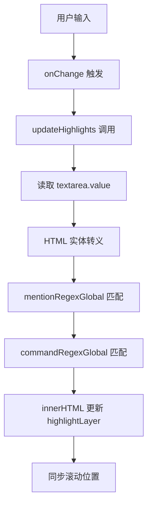
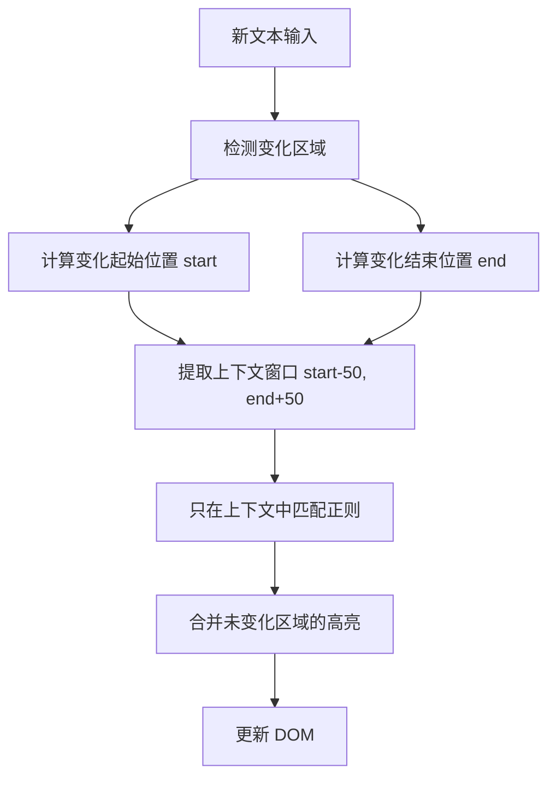

# Webview 输入框性能优化方案

## 问题描述

当 ChatTextArea 输入框中文本内容过多时，出现明显的输入卡顿现象。

## 根本原因分析

### 1. 高频的 `updateHighlights` 调用（主要原因）

**位置**: [`ChatTextArea.tsx:1061-1064`](../../webview-ui/src/components/chat/ChatTextArea.tsx:1061)

```typescript
onChange={(e) => {
  handleInputChange(e)
  updateHighlights()  // 每次输入都调用
}}
```

**问题**: `updateHighlights` 函数 [`ChatTextArea.tsx:749-788`](../../webview-ui/src/components/chat/ChatTextArea.tsx:749) 执行以下操作：
- 对整个文本内容进行正则表达式匹配和替换（`mentionRegexGlobal`、`commandRegexGlobal`）
- 使用 `innerHTML` 直接操作 DOM
- 当文本量很大时，字符串操作和 DOM 操作都会变得非常耗时

### 2. `useLayoutEffect` 同步阻塞渲染

**位置**: [`ChatTextArea.tsx:790-792`](../../webview-ui/src/components/chat/ChatTextArea.tsx:790)

```typescript
useLayoutEffect(() => {
  updateHighlights()
}, [inputValue, updateHighlights])
```

**问题**: `useLayoutEffect` 会在 DOM 更新后**同步**执行，阻塞后续渲染。当 `inputValue` 很长时，这会直接导致输入响应延迟。

### 3. 多层状态更新和重渲染

每次输入都会触发：
- `setInputValue` 状态更新
- `setCursorPosition` 状态更新  
- `setShowContextMenu` 状态更新
- `setSearchQuery` 状态更新
- 文件搜索的防抖定时器（200ms）

这些状态更新会触发组件重新渲染，当文本很长时，渲染开销显著增加。

### 4. 正则表达式性能问题

**位置**: [`ChatTextArea.tsx:760-782`](../../webview-ui/src/components/chat/ChatTextArea.tsx:760)

```typescript
let processedText = text
  .replace(/\n$/, "\n\n")
  .replace(/[<>&]/g, (c) => ...)
  .replace(mentionRegexGlobal, '...')  // 全局匹配
  .replace(commandRegexGlobal, ...)    // 全局匹配 + 回调函数
```

当文本很长时，全局正则表达式匹配和回调函数的开销会成倍增长。

### 5. 缺少防抖/节流优化

`updateHighlights` 在每次 `onChange` 时都立即执行，没有防抖或节流机制。对于快速输入场景，这会导致大量重复计算。

---

## Highlights 功能分析

### 功能作用

Highlights 功能用于在输入框中提供语法高亮显示，增强用户体验：

1. **@mention 高亮**: 高亮显示文件路径、URL、特殊提及（如 `@/path/to/file`、`@problems`、`@git-changes`）
2. **/command 高亮**: 高亮显示有效命令（如 `/new`、`/edit` 等）

### 实现原理



### 必要性评估

**结论**: 功能**并非多余**，但实现方式需要优化

**理由**:
- ✅ 提供用户友好的视觉反馈，帮助用户识别已输入的提及和命令
- ✅ 增强用户体验，类似现代 IDE 的语法高亮效果
- ❌ 当前每次输入都执行全量正则匹配和 DOM 操作，性能开销大
- ❌ 缺少防抖/节流机制
- ❌ `useLayoutEffect` 阻塞渲染

---

## 优化方案设计

### 方案 1：添加防抖机制（推荐优先实施）

**目标**: 减少 `updateHighlights` 的调用频率

**实现**:

```typescript
import { useMemo, useEffect } from 'react'
import { debounce } from 'lodash-es' // 或使用 react-use 的 useDebounce

// 在组件内部
const debouncedUpdateHighlights = useMemo(
  () => debounce(() => {
    updateHighlights()
  }, 150, { leading: true, trailing: true }),
  [updateHighlights]
)

// 清理函数
useEffect(() => {
  return () => debouncedUpdateHighlights.cancel()
}, [debouncedUpdateHighlights])

// 在 onChange 中使用
onChange={(e) => {
  handleInputChange(e)
  debouncedUpdateHighlights() // 使用防抖版本
}}
```

**参数建议**:
- 延迟：150ms
- `leading: true`: 首次输入立即响应
- `trailing: true`: 持续输入时防抖

**预期效果**: 减少约 80-90% 的 `updateHighlights` 调用

---

### 方案 2：useLayoutEffect 改为 useEffect

**目标**: 避免阻塞渲染

**实现**:

```typescript
// 原代码
useLayoutEffect(() => {
  updateHighlights()
}, [inputValue, updateHighlights])

// 优化后
useEffect(() => {
  updateHighlights()
}, [inputValue, updateHighlights])
```

**注意**: 改为 `useEffect` 后可能有短暂闪烁，需配合防抖使用

---

### 方案 3：使用 useMemo 缓存处理结果

**目标**: 避免重复的正则表达式计算

**实现**:

```typescript
// 缓存处理后的 HTML 内容
const processedHtml = useMemo(() => {
  if (!inputValue) return ''
  
  let processedText = inputValue
    .replace(/\n$/, "\n\n")
    .replace(/[<>&]/g, (c) => ({ "<": "<", ">": ">", "&": "&" })[c] || c)
    .replace(mentionRegexGlobal, '<mark class="mention-context-textarea-highlight">$&</mark>')
  
  processedText = processedText.replace(commandRegexGlobal, (match, commandName) => {
    if (isValidCommand(commandName)) {
      const startsWithSpace = match.startsWith(" ")
      const commandPart = `/${commandName}`
      return startsWithSpace 
        ? ` <mark class="mention-context-textarea-highlight">${commandPart}</mark>`
        : `<mark class="mention-context-textarea-highlight">${commandPart}</mark>`
    }
    return match
  })
  
  return processedText
}, [inputValue, commands])

// 在 useEffect 中只更新 DOM
useEffect(() => {
  if (highlightLayerRef.current) {
    highlightLayerRef.current.innerHTML = processedHtml
  }
}, [processedHtml])
```

**预期效果**: 当 `inputValue` 和 `commands` 未变化时，跳过正则计算

---

### 方案 4：增量解析优化（高级方案）

**目标**: 只重新解析变化的文本片段，而非全量文本

**核心思路**:



**实现框架**:

```typescript
const previousState = useRef<{
  text: string
  highlights: Array<{ start: number; end: number; type: 'mention' | 'command' }>
}>({ text: '', highlights: [] })

const detectChange = (oldText: string, newText: string) => {
  let start = 0
  while (start < oldText.length && start < newText.length && oldText[start] === newText[start]) {
    start++
  }
  
  let endOld = oldText.length - 1
  let endNew = newText.length - 1
  while (endOld >= start && endNew >= start && oldText[endOld] === newText[endNew]) {
    endOld--
    endNew--
  }
  
  return { start, endOld, endNew }
}

const updateHighlightsIncremental = () => {
  const text = textAreaRef.current.value
  const change = detectChange(previousState.current.text, text)
  
  // 只重新解析变化区域附近的 @ 和 / 命令
  const contextStart = Math.max(0, change.start - 50)
  const contextEnd = Math.min(text.length, change.endNew + 50)
  const contextText = text.slice(contextStart, contextEnd)
  
  // 在上下文中查找需要更新的提及和命令
  const mentionsInContext = Array.from(contextText.matchAll(mentionRegexGlobal))
  const commandsInContext = Array.from(contextText.matchAll(commandRegexGlobal))
  
  // 构建新的高亮列表（合并未变化区域 + 变化区域）
  // ...
  
  previousState.current = { text, highlights: newHighlights }
}
```

**优势**:
- 对于大文本中的局部编辑，性能提升显著
- 保持高亮的实时性

**劣势**:
- 实现复杂度较高
- 需要处理边界情况（如跨行提及、转义字符等）

---

## 推荐实施方案

### 第一阶段：快速优化（预期性能提升 60-80%）

1. **添加防抖机制** (150ms, leading: true)
2. **useLayoutEffect 改为 useEffect**
3. **使用 useMemo 缓存处理结果**

### 第二阶段：深度优化（预期额外性能提升 20-30%）

4. **增量解析优化**
5. **考虑虚拟滚动**（针对超长文本场景）

---

## 实施步骤

### 步骤 1: 添加防抖工具

检查项目依赖，确认是否需要添加 `lodash-es` 或使用已有的 `debounce` 包。

当前项目已安装:
- `debounce: ^2.1.1` (在 `webview-ui/package.json` 中)

### 步骤 2: 修改 ChatTextArea.tsx

需要修改的关键位置:

| 位置 | 修改内容 | 优先级 |
|------|----------|--------|
| Line 749-788 | 重构 `updateHighlights` 使用 useMemo 缓存 | P0 |
| Line 790-792 | `useLayoutEffect` → `useEffect` | P0 |
| Line 1061-1064 | `onChange` 使用防抖调用 | P0 |
| 新增 | 添加防抖清理逻辑 | P0 |

### 步骤 3: 测试验证

运行现有测试确保功能正常:
```bash
cd webview-ui
pnpm test -- src/components/chat/__tests__/ChatTextArea.spec.tsx
```

---

## 预期效果

| 优化项 | 预期性能提升 | 实施难度 |
|--------|--------------|----------|
| 防抖机制 | 50-60% | 低 |
| useEffect 替换 | 10-15% | 低 |
| useMemo 缓存 | 20-30% | 中 |
| 增量解析 | 30-50% | 高 |

**综合预期**: 第一阶段优化后，长文本输入卡顿问题应得到显著改善。

---

## 相关代码位置

| 文件 | 行号 | 说明 |
|------|------|------|
| [`ChatTextArea.tsx`](../../webview-ui/src/components/chat/ChatTextArea.tsx:1) | 749-788 | `updateHighlights` 函数 |
| [`ChatTextArea.tsx`](../../webview-ui/src/components/chat/ChatTextArea.tsx:1) | 790-792 | `useLayoutEffect` 调用 |
| [`ChatTextArea.tsx`](../../webview-ui/src/components/chat/ChatTextArea.tsx:1) | 1061-1064 | `onChange` 事件处理 |
| [`context-mentions.ts`](../../src/shared/context-mentions.ts:65) | 65 | `mentionRegexGlobal` 定义 |
| [`context-mentions.ts`](../../src/shared/context-mentions.ts:68) | 68 | `commandRegexGlobal` 定义 |

---

## 参考文档

- [React useLayoutEffect vs useEffect](https://react.dev/reference/react/useEffect#differences-between-useeffect-and-uselayouteffect)
- [Lodash debounce](https://lodash.com/docs/4.17.15#debounce)
- [React useMemo](https://react.dev/reference/react/useMemo)
